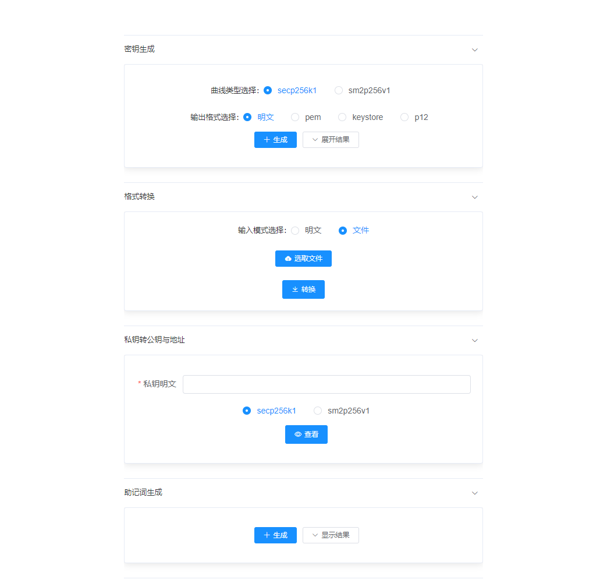

# 快速开始

## 前置依赖

在使用本组件前，请确认系统环境已安装相关依赖软件，清单如下：

| 依赖软件 | 说明 |备注|
| --- | --- | --- |
| Java | JDK[1.8] | |
| Git | 下载源码需使用Git | |
| 浏览器 |  | 使用key-core可视化功能需要|
| MySQL | >= mysql-community-server[5.7] | 使用key-mgr托管时需要|


如果您还未安装这些依赖，请参考[附录](../appendix.md)。

## 基本术语

使用本组件前，请先确保理解下述基本术语：

| 术语 | 说明 |
| --- | --- |
| 椭圆曲线 | 一族曲线，广泛用于密码学。这里仅指国际secp256k1椭圆曲线或国密sm2p256v1椭圆曲线 |
| 私钥 | 用户私有密钥，用于签名、解密等。这里特指基于椭圆曲线的私钥 |
| 公钥 | 公开的密钥，用于验签、加密等。这里特指基于椭圆曲线的公钥| 
| 地址 | 由公钥经特定哈希方式生成的账户地址| 
| 助记词 | 一串单词文本，解决私钥难以记忆、表达的问题。可结合口令得到私钥 | 
| 派生 | 私钥根据不同场景生成子私钥的过程，用于减低记忆成本、泄露风险。私钥公钥均可派生。| 
| chaincode | 生成密钥时会附带一个链码，用于安全派生子密钥| 
| 密钥导出 | 指将私钥按固定格式加密导出，如keystore、pem、p12等|
| 密钥恢复 | 将加密导出的私钥还原为私钥明文|
| 分片 | 将数据分为若干块的过程| 
| 还原 | 将碎块还原为原始完整数据的过程|

## 源码下载

通过git 下载源码.
```
cd ~
git clone https://github.com/WeBankBlockchain/Governance-Key.git
cd Governance-Key
```

## key-core快速开始

key-core支持可视化方式操作，也支持sdk方式操作。可视化方式下，需要系统装有浏览器。

### 可视化方式使用

进入目录：
```
cd key-core-web
```

编译代码：
```
gradle bootJar
```

编译后，会生成dist目录，包含key-core-web.jar包。

启动可视化界面：
```
cd dist
java -jar key-core-web.jar
```

启动成功后，会自动弹出浏览器页面。如果未自动弹出，也可以访问localhost:8001端口。网页效果如下：



页面包含功能如下：

| 功能 | 说明 | 备注 |
| --- | --- | --- |
| 私钥生成 | 生成一个椭圆曲线私钥。可支持明文、密文，密文可能要求输入加密口令 | 支持国密|
| 格式转换 | 明文格式的私钥和密文格式私钥的互转 | 支持国密、多种加密格式|
| 公钥和地址生成 | 将私钥转换为公钥和地址 | 支持国密|
| 助记词生成 | 生成一个助记词，此助记词可用于生成私钥 | |

### sdk方式使用

#### 源码编译

进入目录:

```
cd ~/Governance-Key/key-core
```

编译代码：
```
gradle build -x test
```
完成编译之后，在根目录下会生成dist文件夹，文件夹中包含key-core.jar。
#### 引入jar包
将dist目录中的key-core.jar包导入到自己的项目中，例如放到libs目录下。然后进行依赖配置，以gradle为例，依赖配置如下：
```
repositories {
    maven {
        url "http://maven.aliyun.com/nexus/content/groups/public/"
    }
    maven { url "https://oss.sonatype.org/service/local/staging/deploy/maven2"}
    maven { url "https://oss.sonatype.org/content/repositories/snapshots" }
    mavenLocal()
    mavenCentral()
}

dependencies {
    compile 'com.webank:webankblockchain-crypto-core:1.0.0-SNAPSHOT'

    compile "org.apache.commons:commons-lang3:3.6"
    compile group: 'org.bouncycastle', name: 'bcprov-jdk15on', version: '1.60'
    compile group: 'org.bouncycastle', name: 'bcpkix-jdk15on', version: '1.60'
    compile 'org.web3j:core:3.4.0'
    compile "commons-io:commons-io:2.6"
    compile 'com.lambdaworks:scrypt:1.4.0'
    compile 'commons-codec:commons-codec:1.9'
    testCompile group: 'junit', name: 'junit', version: '4.12'
    compile fileTree(dir:'libs',include:['*.jar'])
}
```
#### 使用示例

##### 随机数方式生成私钥

```java
    public static void main(String[] args) throws Exception{
        //生成非国密私钥
        PkeyByRandomService eccService = new PkeyByRandomService();
        PkeyInfo eccKey = eccService.generatePrivateKey();
        System.out.println("private key:"+ KeyPresenter.asString(eccKey.getPrivateKey()));
        System.out.println("public key:" + KeyPresenter.asString(eccKey.getPublicKey().getPublicKey()));
        System.out.println("address:" +eccKey.getAddress());

        //生成国密私钥
        PkeySM2ByRandomService gmService = new PkeySM2ByRandomService();
        PkeyInfo gmPkey = gmService.generatePrivateKey();
        System.out.println("private key:"+ KeyPresenter.asString(gmPkey.getPrivateKey()));
        System.out.println("public key:" + KeyPresenter.asString(gmPkey.getPublicKey().getPublicKey()));
        System.out.println("address:" +gmPkey.getAddress());
    }
```

##### 私钥转换为公钥地址


```java
    public static void main(String[] args) throws Exception{
        byte[] privateKey = KeyPresenter.asBytes( "0xed1d9dc98c8496b9837cb8c46a2302b9d479aab08f536dc0785115c11990d7f3");
        PkeyInfo pkeyInfo
                = PkeyInfo.builder()
                .privateKey(privateKey)
                .eccName(EccTypeEnums.SECP256K1.getEccName())
                .build();

        System.out.println("public key :" + KeyPresenter.asString(pkeyInfo.getPublicKey().getPublicKey()));
        System.out.println("address :" + pkeyInfo.getAddress());
    }
```

##### 助记词方式生成私钥
```java
    public static void main(String[] args) throws Exception{
        //助记词生成
        PkeyByMnemonicService mnemonicService = new PkeyByMnemonicService();
        String mnemonic = mnemonicService.createMnemonic();
        System.out.println("Mnemonic:"+mnemonic);
        //生成非国密私钥
        PkeyInfo pkey = mnemonicService.generatePrivateKeyByMnemonic(mnemonic, "passphrase", EccTypeEnums.SECP256K1);
        System.out.println("ECC Private Key:"+ KeyPresenter.asString(pkey.getPrivateKey()));
        System.out.println("ECC Chaincode:"+ KeyPresenter.asString(pkey.getChainCode()));
        System.out.println("ECC Address:"+ pkey.getAddress());
        //生成国密私钥
        PkeyInfo gmkey = mnemonicService.generatePrivateKeyByMnemonic(mnemonic, "passphrase", EccTypeEnums.SM2P256V1);
        System.out.println("GM Private Key:"+ KeyPresenter.asString(gmkey.getPrivateKey()));
        System.out.println("GM Chaincode:"+ KeyPresenter.asString(gmkey.getChainCode()));
        System.out.println("GM Address:"+ gmkey.getAddress());
    }
```

##### 密钥派生
```java
   public static void main(String[] args) throws Exception{
        //通过助记词获得私钥
        PkeyByMnemonicService mnemonicService = new PkeyByMnemonicService();
        String mnemonic = mnemonicService.createMnemonic();
        PkeyInfo key = mnemonicService.generatePrivateKeyByMnemonic(mnemonic, "passphrase", EccTypeEnums.SECP256K1);

        //私钥派生私钥
        PkeyHDDeriveService deriveService = new PkeyHDDeriveService();
        ExtendedPrivateKey rootKey = deriveService.buildExtendedPrivateKey(key);
        //派生子私钥
        ExtendedPrivateKey subPrivKey = rootKey.deriveChild(2);
        System.out.println("child no.2: "+ KeyPresenter.asString(subPrivKey.getPkeyInfo().getPrivateKey()));
        //子私钥转子公钥
        ExtendedPublicKey subPubKey= subPrivKey.neuter();
        System.out.println("pubkey for child no.2: "+ KeyPresenter.asString(subPubKey.getPubInfo().getPublicKey()));
        //BIP-44派生
        Purpose44Path derivePath = deriveService.getPurpose44PathBuilder().m()
                .purpose44().sceneType(2)
                .account(3).change(4).addressIndex(5).build();
        ExtendedPrivateKey derived = derivePath.deriveKey(rootKey);
        System.out.println("derived for bip 44 "+ KeyPresenter.asString(derived.getPkeyInfo().getPrivateKey()));
    }
```

##### 私钥加密导出到目录
```java
    public static void main(String[] args) throws Exception{
        PkeyInfo pkeyInfo
                 = PkeyInfo.builder()
                .privateKey(Numeric.hexStringToByteArray("252ffefe4e3856eb84a4fba5f07fc2066d3043a763cb74ed16ff093ac79b52d6"))
                .eccName(EccTypeEnums.SECP256K1.getEccName())
                .build();

        String dir = System.getProperty("user.dir")+ File.separator+"keystores";
        PkeyEncryptService pkeyEncryptService = new PkeyEncryptService();
        pkeyEncryptService.encryptKeyStoreFormat("123456", pkeyInfo.getPrivateKey(), EccTypeEnums.SECP256K1, dir);
    }
```
##### 私钥分片与还原
```java
    public static void main(String[] args) throws Exception{
        //生成一个私钥
        PkeyByRandomService generateService = new PkeyByRandomService();
        PkeyInfo pkeyInfo = generateService.generatePrivateKey();
        System.out.println("Before sharding "+KeyPresenter.asString(pkeyInfo.getPrivateKey()));
        //开始分片，分解为5片，凑齐任意3片才能还原
        PkeyShardingService shardingService
                = new PkeyShardingService();
        List<String> shards = shardingService.shardingPKey(pkeyInfo.getPrivateKey(), 5, 3);
        //还原
        List<String> recoveredShards = new ArrayList<>();
        recoveredShards.add(shards.get(0));
        recoveredShards.add(shards.get(2));
        recoveredShards.add(shards.get(3));
        byte[] recovered = shardingService.recoverPKey(recoveredShards);
        System.out.println("After recovered "+ KeyPresenter.asString(recovered));
    }
```
##### 密码学操作
下述例子包含了签名、验签、数据加密、数据解密。
```java
    public static void main(String[] args){
        //Case 1: Ecc(secp256k1) sign and verify
        String eccMsg = "HelloEccSign";
        String eccPrivateKey = "28018238ac7eec853401dfc3f31133330e78ac27a2f53481270083abb1a126f9";
        String eccPublicKey = "0460fc2bce5795ee2ac34d1f584f603b4e2920a95d8d3db5f5c664244a99fd76405831ffaf932f64eae3ec67bc8ff7bfed9039f29bf39ce6583d55ca449b64319e";

        ECCSignService eccSignService = new ECCSignService();
        String eccSignature = eccSignService.sign(eccMsg, eccPrivateKey);
        System.out.println("ecc signature:"+eccSignature);

        boolean eccVerifyResult = eccSignService.verify(eccMsg, eccSignature, eccPublicKey);
        System.out.println("ecc verify result:"+eccVerifyResult);

        //Case 2: Ecc(secp256k1) encryption and decryption
        ECCEncryptService eccEncryptService = new ECCEncryptService();
        String eccCipherText = eccEncryptService.encrypt(eccMsg, eccPublicKey);
        System.out.println("ecc encryption cipher:"+eccCipherText);

        String eccPlainText = eccEncryptService.decrypt(eccCipherText, eccPrivateKey);
        System.out.println("ecc decryption result:"+eccPlainText);

        //Case3: Gm(sm2p256v1) sign and verify
        String gmMsg = "HelloGM";
        String gmPrivateKey = "73c8a8054b5e42b0d089e24f16c665bc82a132082d258c5efb54c49a3b7273f9";
        String gmPublicKey = "0451c895673d372267a565c4a7711102108138132b21f22ed556df08fb4c8cfdcaf17dcb605f8a6394f8684aa1916df60929532faf808c36c133ce52356d0f45f3";

        SM2SignService sm2SignService = new SM2SignService();
        String gmSignature = sm2SignService.sign(gmMsg, gmPrivateKey);
        System.out.println("gm signature:"+gmSignature);

        boolean gmVerifyResult = sm2SignService.verify(gmMsg, gmSignature, gmPublicKey);
        System.out.println("gm verify result:"+gmVerifyResult);

        //Case4: Gm(sm2p256v1) encryption and decryption
        SM2EncryptService gmEncryptService = new SM2EncryptService();
        String gmCipherText = gmEncryptService.encrypt(gmMsg, gmPublicKey);
        System.out.println("gm encryption cipher:"+gmCipherText);

        String gmPlainText = gmEncryptService.decrypt(gmCipherText, gmPrivateKey);
        System.out.println("gm decryption result:"+gmPlainText);
    }

```
## key-mgr快速开始

进入目录：
```
cd ~/Governance-Key/key-mgr
```

### 编译源码

```
gradle build -x test
```

### 引入jar包
完成编译之后，在根目录下会生成dist文件夹，文件夹中包含key-mgr.jar。将其导入到自己的项目中，例如放到libs目录下。然后进行依赖配置，以gradle为例，依赖配置如下：
```
repositories {
    maven {
        url "http://maven.aliyun.com/nexus/content/groups/public/"
    }
    maven { url "https://oss.sonatype.org/service/local/staging/deploy/maven2"}
    maven { url "https://oss.sonatype.org/content/repositories/snapshots" }
    mavenLocal()
    mavenCentral()
}

dependencies {

    compile 'org.springframework.boot:spring-boot-starter'
    compile 'org.springframework.boot:spring-boot-starter-data-jpa'

    testCompile('org.springframework.boot:spring-boot-starter-test') {
        exclude group: 'org.junit.vintage', module: 'junit-vintage-engine'
        //exclude group: 'junit', module: 'junit'
    }
    compile 'org.springframework.boot:spring-boot-starter-jta-atomikos'
    compile ('org.projectlombok:lombok:1.18.8')
    compile ('org.projectlombok:lombok:1.18.8')
    annotationProcessor 'org.projectlombok:lombok:1.18.8'
    compile "org.apache.commons:commons-lang3:3.6"
    compile "commons-io:commons-io:2.6"

    compile "com.fasterxml.jackson.core:jackson-core:2.9.6"
    compile "com.fasterxml.jackson.core:jackson-databind:2.9.6"
    compile "com.fasterxml.jackson.core:jackson-annotations:2.9.6"

    compile 'com.lhalcyon:bip32:1.0.0'
    //compile 'io.github.novacrypto:BIP44:0.0.3'

    compile group: 'org.bouncycastle', name: 'bcprov-jdk15on', version: '1.60'
    compile group: 'org.bouncycastle', name: 'bcpkix-jdk15on', version: '1.60'
    compile 'org.web3j:core:3.4.0'
    compile 'com.lambdaworks:scrypt:1.4.0'
    compile 'commons-codec:commons-codec:1.9'

    compile 'mysql:mysql-connector-java'
    compile 'com.webank:webankblockchain-crypto-core:1.0.0-SNAPSHOT'
    compile fileTree(dir:'libs',include:['*.jar'])
}
```

### 配置

如果仅出于体验的目的，无需做任何配置，托管后的加密密钥会被保存到~/.pkeymgr。如果需要更高级的配置，请参考下面的模板，配置application.properties。
```
# true-存储密码（全信任模式），false-不存储密码（半信任模式）
system.storePwd=true
# 托管方式：db-数据库托管方式，file-文件托管方式
system.mgrStyle=db

### 该配置仅为system.mgrType=file时的配置
#### system.dataFileDir=~/myKeys

## 加密格式，支持p12或keystore
system.keyEncType=p12
## 可以用secp256k1 or sm2p256v1。后者为国密曲线。
system.eccType=sm2p256v1

## 加密后的私钥存储url
spring.datasource.encryptkeydata.url=jdbc:mysql://[ip]:[port]/pkey_mgr?autoReconnect=true&characterEncoding=utf8&useSSL=false&serverTimezone=GMT%2b8
spring.datasource.encryptkeydata.username=
spring.datasource.encryptkeydata.password=

## 若存储密码
spring.datasource.keypwd.url=jdbc:mysql://[ip]:[port]/pkey_mgr_pwd?autoReconnect=true&characterEncoding=utf8&useSSL=false&serverTimezone=GMT%2b8
spring.datasource.keypwd.username=
spring.datasource.keypwd.password=

## spring jpa config
spring.jpa.properties.hibernate.hbm2ddl.auto=update
spring.jpa.properties.hibernate.show_sql=true
spring.jpa.database-platform=org.hibernate.dialect.MySQL5InnoDBDialect
```

### 建表

如果在上述配置中指定了**spring.jpa.properties.hibernate.hbm2ddl.auto=update**，则jpa会帮助用户自动建立数据表。

如果不希望自动建立数据表，请先关闭jpa建表开关：
```
spring.jpa.properties.hibernate.hbm2ddl.auto=validate
```
然后按下面方式手动建表。

1） 在encryptkeydata数据源运行下述建表语句：

```

CREATE TABLE `encrypt_keys_info` (
   `pk_id` bigint(20) NOT NULL AUTO_INCREMENT,
   `encrypt_key` longtext,
   `key_address` varchar(255) DEFAULT NULL,
   `key_name` varchar(255) DEFAULT NULL,
   `parent_address` varchar(255) DEFAULT NULL,
   `user_id` varchar(255) DEFAULT NULL,
   `ecc_type` varchar(255) DEFAULT NULL,
   `enc_type` varchar(255) DEFAULT NULL,
   PRIMARY KEY (`pk_id`),
   KEY `user_id` (`user_id`),
   KEY `key_address` (`key_address`)
 ) ENGINE=InnoDB AUTO_INCREMENT=5 DEFAULT CHARSET=utf8
 

```

2） 请在keypwd数据源运行下述建表语句：

```
CREATE TABLE `key_pwds_info` (
   `pk_id` bigint(20) NOT NULL AUTO_INCREMENT,
   `key_address` varchar(255) DEFAULT NULL,
   `key_pwd` varchar(255) DEFAULT NULL,
   `user_id` varchar(255) DEFAULT NULL,
   PRIMARY KEY (`pk_id`),
   KEY `user_id` (`user_id`),
   KEY `key_address` (`key_address`)
 ) ENGINE=InnoDB AUTO_INCREMENT=8 DEFAULT CHARSET=utf8
```

### 接口使用

KeysManagerService类是整个pkey-mgr模块的入口，覆盖私钥管理的全生命周期，包含如下功能：

| 功能 | 说明 |
| --- | --- |
| createPrivateKey |生成私钥，并进行托管存储|
| importPrivateKeyFile |导入私钥原文，并进行托管存储| 
| createPrivateKeyByParent|根据父私钥和chaincode，生成子私钥，并进行托管存储| 
| queryChildKeys |查询父私钥的所有直接下级子私钥| 
| exportPrivateKeyFile |从库中读取私钥密文，并导出到密文文件| 
| decryptPrivateKey |解密私钥密文，得到明文| 
| getEncryptPrivateKeyList |获取某用户的所有私钥密文列表| 
| getEncryptPrivateKeyByUserIdAndAddress |根据用户id、私钥地址获取私钥密文| 
| updateKeyName |更新私钥名称| 
| updateKeyPassword |重置私钥密码|
| deleteUserKey |删除某用户的某一私钥|


建议您通过Spring自动注入KeysManagerService服务，示例如下：

```
@SpringBootTest
@RunWith(SpringRunner.class)
public class Example {

    @Autowired
    private KeysManagerService keysManagerService;

}
```

#### createPrivateKey

该方法用于随机生成私钥，并进行托管存储。

```
@Test
public void demo() throws Exception {
    String userId = "1000";
    String password = "123456";
    String keyName = "MyKey";
    keysManagerService.createPrivateKey(userId, password, keyName);
}

```

执行过后，可在encryptkeydata数据源的encrypt_keys_info表查看存储的私钥；如果配置了双库（system.storePwd=true），可通过keypwd数据源的key_pwds_info表查看密码存储结果。

**参数说明**：

- userId: 用户id

- password：私钥加密密码

- keyName：私钥名称

#### importPrivateKeyFile

该方法用于从p12或keystore文件中提取私钥，并进行托管存储。按哪种格式提取取决于applicaiton.properties中配置的是p12还是keystore，故要注意确保文件格式和配置相符。

```
@Test
public void demo() throws Exception {
    String userId = "1000";
    String password = "123456";
    String path = "~/keys/enryptFile.p12";
    keysManagerService.importPrivateKeyFile(userId, password, path);
}
```
执行过后，可在encryptkeydata数据源的encrypt_keys_info表查看存储的私钥；如果配置了双库（system.storePwd=true），可通过keypwd数据源的key_pwds_info表查看密码存储结果。

**参数说明**：

- userId: 用户id

- password：该密码负责解密密文文件；也负责在托管存储时给私钥加密。

- filePath：密文文件目录。需要和application.properties中的system.keyEncType保持一致。

#### importPrivateKey

该方法用于直接导入私钥原文，并对其托管存储。

```
@Test
public void demo() throws Exception {
    String userId = "1000";
    String password = "123456";
    String privateKey = "0xeec37c95fb78c49132513882bb293fd6ecdef194e85efcc654af0d9c291995ec";
    String keyName = "MyKey";
    keysManagerService.importPrivateKey(userId, password, privateKey, keyName);
}
```
执行过后，可在encryptkeydata数据源的encrypt_keys_info表查看存储的私钥；如果配置了双库（system.storePwd=true），可通过keypwd数据源的key_pwds_info表查看密码存储结果。

**参数说明**：

- userId: 用户id

- password：该密码负责解密密文文件；也负责在托管存储时给私钥加密。

- privateKey: 16进制的私钥原文

- keyName: 私钥名称

#### createPrivateKeyByParent

该方法通过父私钥原文和一个chaincode来确定性地派生子私钥。派生过后的子私钥也会被导入托管。

```
@Test
public void demo() throws Exception {
    String userId = "1200";
    String parentKey = "eec37c95fb78c49132513882bb293fd6ecdef194e85efcc654af0d9c291995ec";
    //首先导入父私钥
    keysManagerService.importPrivateKey(userId, "123456",parentKey , "parentKey");
    //派生子私钥并导入
    String chaincode1 = "123";
    String password1 = "pwd1";
    keysManagerService.createPrivateKeyByParent(userId, parentKey,chaincode1, password1);
    String chaincode2 = "xyz";
    String password2 = "pwd2";
    keysManagerService.createPrivateKeyByParent(userId, parentKey,chaincode2, password2);
}
```

执行过后，可在encryptkeydata数据源的encrypt_keys_info表查看存储的子私钥；如果配置了双库（system.storePwd=true），可通过keypwd数据源的key_pwds_info表查看密码存储结果。

**参数说明**：

- userId: 用户id

- parentKey：父私钥原文。需为16进制私钥原文。

- chaincode: 任意字符串。比如可以传入一串UUID。

- password: 子私钥名称


#### queryChildKeys

该方法用于查询一个父私钥所关联的下级子私钥。

```
@Test
public void demo() throws Exception {
    String userId = "1200";
    String parentAddress = "9349e27ae2202202bd0487d4aa08705a14c52710";
    //Query child keys
    List<EncryptKeyInfo> childs = keysManagerService.queryChildKeys(userId, parentAddress);
    log.info("Child keys {}", JacksonUtils.toJson(childs));
}
```


**参数说明**：

- userId: 用户id

- parentAddress：父私钥的地址


#### exportPrivateKeyFile

该方法根据用户id、私钥地址从库中读取私钥，以所配置的格式导出到目标目录。

```
@Test
public void demo() throws Exception {
    String userId = "1200";
    String keyAddress = "9349e27ae2202202bd0487d4aa08705a14c52710";
    String destinationDirectory = "C:\\Users\\unnamed\\Desktop\\keys";
    keysManagerService.exportPrivateKeyFile(userId, keyAddress, destinationDirectory);
}
```

执行过后，将在destinationDirectory指定的目录内，得到一个加密的p12或keystore文件（取决于system.keyEncType配置）

**参数说明**：

- userId: 用户id

- keyAddress: 私钥地址

- destinationDirectory：输出目录


#### decryptPrivateKey

该方法将一个密文解密为原文。密文格式取决于system.keyEncType配置。下面示例中，是解密p12的示例，要求system.keyEncType=p12:

```
@Test
public void testDecryptP12() throws Exception{
    String enc = "0x3082070c020103308206c506092a864886f70d010701a08206b6048206b2308206ae3081e306092a864886f70d010701a081d50481d23081cf3081cc060b2a864886f70d010c0a0102a07f307d3029060a2a864886f70d010c0103301b04146d3141aed3d7837dcbbe3f6b0e1dd538a62fa577020300c800045006b3589535cd1f711b047aa7ede5f85277855268d26d743bcb7337baeb529084528ea8b9efcfb3fc7bca116858cd4c5aa03bb4acc15dab0815a0b2612e221aa9a9ad404c1c5320d6687b0b350a1096cc313c301506092a864886f70d01091431081e06006b00650079302306092a864886f70d01091531160414f20a0fd2441cfd87e5e9ae1c82955355eaedc48a308205c406092a864886f70d010706a08205b5308205b1020100308205aa06092a864886f70d0107013029060a2a864886f70d010c0106301b0414387f30e3fb68e49b8a852ed4bcb7a69d203c7f11020300c80080820570b20de65feca9bfdb1c92c8b18d5da0ab6d08079e8c90b28f67262599e9187186e1608a093f8f0d4f5f5bce57d4623244fc15e9a9449e4e00b6fe18f900781c3bbfb541211b64c2e322ad7b4cc2ff09aa158260d913101da8c1346c55aa9af7df85dba58796f8611d99cda6f69dbe5a42fad45b8d7c9cddf9b793f1da61c8357d52d0522b09629ac1cf5b45b8f199c2065fc4c35c53967385471d87f53ceabb9c5b4e33f6e394159c115b3f0c0ad6bd0ab051fc14ce13c0774e257e963f59ac8e0a51e32aad5f81e193bd61c5f124f47e54bd1ba08bffe16dfe7e7e5b5a6141caab01c33445ec7e7df705ecd6309d85421075d485829e2eb946288d5a58072ace5821bcb305253ee0c8cca0aa2701143811fe6622e728dc74d64121fb1953932dd0d151e7c07cd6afa8190eb5ee29f9121e05276a990b356f5023eeaa8ad4b69a45ca3aa64b9375f63e1faf6b57f97f1d62b687ae30bd2a5e264bc57ae9329e39ea1efc35dde49be8666e12d8b4ca8b0375bbab21147c0851d4bf0233903c8a0812f24ccab9b983819cc257b010e5df59ac24b1e40e6570e190f15262f977b25b7cb1c75dfb9b557980b5d71ce4b366d1af93a206c3293845be29e7ee76c8395ba998b7fad51c71d40dabdc1e224f86c287ab8751324db51da489f9d09f6a3405f065deeee929f82efa29826ca54e60104d232347ffc244f2dd1d39bdb30e54a4a01ab96aa0eac56d9fa6fe2b95a50031c0f0d1ebb70886141abe332ebec57be2adde71494478d63207ce4250b3fec03549ff6e986dbdbf50035d4d3f49af06cdf644011e83044b09be80fc999f90613c37eb009bc5912d873a2a27d0d31e8c212d66fb283051260ce6601ee84079263eeecdc8eba5e92b2a405ecc4772c8a07ab2e384ea731bd0b98f82970267a2393d1818f4bde69ead067ed0a237ed1677d67da54cec2c082cf1a152b9b36e6f0aee8e5ca7c1095ec34d4356b09fa69045e8b7146a4e2ad92acc731c947e8e09470622dcb68d7ca6b7066643d0b460cb74ec6b2428301a92a22600f0bc14021b8da017c4ff208f371e821fd9eda2907a99665d57ac037fef070f699b854b32a2fe2c9f5cceeda9071eec5c4031bdf82dcf2a4bd8bcaeb6ecfa04ee77c821e49e01a80aa2871f2a4133bd092534758d9f466174122b620531d8527ada06c74753ee9aad7717713f2505282649007e78654169b1c3df5b04c42e38f22f290d14ac98dc03ab23134e879bcb5fd221d5720be73f2b2ee5f30e0c9e10ef59f00c07c3138bc3f9c721c07f410f7c092c47f084f5f008e844ae3461c0886a12e41d66e71549fa5855bcdfd60609e705aff2444a2787da33c05d990a69384b549cc54a5964571e255d1be81898782a7e1a0b6503ae7b1580e2fe7e0f0b5851ae3c14ab95605287a49d370fd850c8f8e7a8e4769bcb13f5905d10ba549a1ead102af288fa347907f7d50e55e5c647be8dda2c026ce33e4f9db1fb12aba097fd768c25a489506bf4c19e37af8724d8ce72720bea91b2d13ffbae8d609b952b07bc413d965b83a1eba5298da592edb259303e50725981534483bea8a1ba9bd41b7d09140edee6d2d2f13cfee4f58b1f1af8be26222a34dcd554a21caf3e99873fe01dbc0eda3db7e614309e6766a48bae260c26c7069263c8a03b4132603862ad305235ebb2e333508edceb2ed9331373745d3bbef2671f81d74941f89565e2ebd35a6a9ff34ecadc50f80c611cef4a13812be06a4907485206f3bc7ca090c8507373b1d8027bf80db0276e1d5edd584c83033176262eaafdd9bc86ffc7ecae7a7063d614042dbaafba67a8882426380c31ec062f8f457bdf05960265a64573fe41b6abdb343ef592329a9c3fe779624fc2a1e402960998e6897bd5fd624427cce445c63f20dc416996604e605b302ccda0f060adc279773e0aebfe6af104987eacc79d9ac5bc9e303e3021300906052b0e03021a05000414e345e97aba172725ef5cb7c8d083c39c22d7f89a0414b04eebce412c47ff69c9c4a7806df85a3352cce00203019000";
    String pk = keysManagerService.decryptPrivateKey("123456", enc);
    log.info("recovered {}", pk);
}

```

下面示例中，是解密keystore的示例，要求system.keyEncType=keystore:

```
 @Test
public void testDecryptKeystore() throws Exception{
    String enc = "{\"address\":\"0x68e1d0ad5ebc77feeaaac712e55cd274a2b1d33a\",\"id\":\"c5f82b87-b25a-42b7-baa1-51871ffae0eb\",\"version\":3,\"crypto\":{\"cipher\":\"aes-128-ctr\",\"ciphertext\":\"0ca68b721be5d1556cbd9be2b3b043e7e1ddf1458d89a43339a24b71d2f2bb3c\",\"cipherparams\":{\"iv\":\"7fa497df863424072f7964d480095bfd\"},\"kdf\":\"scrypt\",\"kdfparams\":{\"dklen\":32,\"n\":262144,\"p\":1,\"r\":8,\"salt\":\"6e039e411821bde52b17481a8759ff66548ba97f4d2e094262d06f93a9f6844c\"},\"mac\":\"04e8d244a4ed9c5206952ba17cb9a49560a2ce141c52a60dac15fbca1f3544db\"}}";
    String pk = keyManagerService.decryptPrivateKey("password", enc);
    log.info("recovered {}", pk);
}
```


**参数说明**：

- password: 解密密码

- encryptPrivateKey: 密文数据。可从encryptkeydata数据源的encrypt_keys_info表的encrypt_key字段获取。

#### getEncryptPrivateKeyList

该方法读取某一用户的所有私钥密文。

```
@Test
public void demo() throws Exception {
    String userId = "1200";
    List<EncryptKeyInfo> keys = keysManagerService.getEncryptPrivateKeyList(userId);
    log.info("keyStrings {}", JacksonUtils.toJson(keys));
}
```

**参数说明**：

- userId: 用户id

#### getEncryptPrivateKeyByUserIdAndAddress

该方法读取某一用户下某地址对应的私钥密文。

```
@Test
public void demo() throws Exception {
    String userId = "1000";
    String address = "e4cbf2581d2fc8541613079440cfbdbf2595b127";
    EncryptKeyInfo key = keysManagerService.getEncryptPrivateKeyByUserIdAndAddress(userId, address);
    log.info("keyStrings {}", JacksonUtils.toJson(key));
}
```

**参数说明**：

- userId: 用户id

- address：私钥地址

#### updateKeyName

updateKeyName更新库中的私钥名称。

```
@Test
public void demo() throws Exception {
    String userId = "1200";
    String address = "9349e27ae2202202bd0487d4aa08705a14c52710";
    String newKeyName = "newKeyName";
    keysManagerService.updateKeyName(userId, address, newKeyName);
}
```

执行过后，可在encryptkeydata数据源的encrypt_keys_info表的key_name字段查看新的私钥名。

**参数说明**：

- userId: 用户Id

- address: 私钥地址

- newKeyName：新的名称


#### updateKeyPassword

更新私钥密码。

```
@Test
public void demo() throws Exception {
    String userId = "1200";
    String address = "9349e27ae2202202bd0487d4aa08705a14c52710";
    String oldPwd = "123456";
    String newPwd = "654321";
    keysManagerService.updateKeyPassword(userId, address, oldPwd, newPwd);
}
```

执行过后，可在encryptkeydata数据源的encrypt_keys_info表查看修改过的密文；如果配置了双库（system.storePwd=true），可通过keypwd数据源的key_pwds_info表的key_pwd字段看到新的密码。

**参数说明**：

- userId: 用户Id

- address: 私钥地址

- oldPwd：旧密码

- newPwd：新密码


#### deleteUserKey示例

根据用户Id和私钥地址来删除私钥。

```
@Test
public void demo() throws Exception {
    String userId = "1200";
    String keyAddress = "9349e27ae2202202bd0487d4aa08705a14c52710";
    keysManagerService.deleteUserKey(userId, keyAddress);
}
```

执行过后，可在encryptkeydata数据源的encrypt_keys_info表查看到私钥已删除；如果配置了双库（system.storePwd=true），可通过keypwd数据源的key_pwds_info表看到密码已删除。

**参数说明**：

- userId: 用户Id

- keyAddress: 私钥地址


