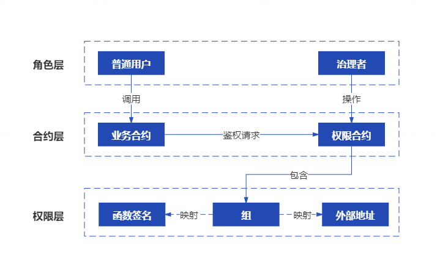

# 组件介绍

## 背景

随着智能合约业务日益丰富，越来越多的合约需要引入权限控制。如果不对智能合约做权限控制，那么无法满足业务的安全性要求。例如，存证场景中，除了上传存证的函数外，还有许多专供审核人员调用的函数，这些函数应仅由审核人员来使用，如果这些函数没有正确设置权限拦截逻辑，整套逻辑就会被攻击者轻易操控。

权限治理组件的目的在于为智能合约开发者提供权限控制功能。开发者只要添加少量代码，即可拦截非法调用。同时，有一个专门的权限治理合约用于治理各个业务合约的拦截规则，对规则的修改只需操作权限治理合约，不需要调整业务合约，且修改会实时生效。

## 特性
### 函数级的权限粒度
在权限体系中，可以为每个函数单独设置权限，同一个合约中的不同函数可有不同的权限设置。
### 批量设置用户权限
合约函数的权限配置基本单位为组，使得可以设置整批账户的权限访问规则。
### 侵入性低
业务合约只需要在代码中引入权限合约地址，并通过在需要权限控制的函数中访问权限合约的权限判断接口，就可以实现权限控制。
### 易于集成
对于权限管理人员，既支持通过手动方式来调用权限合约，也支持通过sdk方式进行调用。
### 支持多种治理方式
允许中心化和去中心化两种方式进行权限治理。在中心化方式中，有一位管理员，可以直接设置各个账户的权限信息；在去中心化方式下，有一个治理委员会，治理委员会成员通过投票来决定如何更改权限信息。

## 整体原理
整体原理如下：

合约角度来看，合约分为业务合约和权限合约，业务合约包含了业务逻辑，权限合约包含了权限信息。从角色划分来看，参与角色分为普通调用者和管理员，普通调用者用于调用业务合约，而管理员负责修改权限合约中的合约信息。

当普通调用者在调用业务合约的时候，植入在业务合约内部的拦截器会向权限合约查询该用户是否有权限调用该函数。对于权限合约而言，权限判断依赖于存储其内的“组权限信息列表”，每个组都记录了包含哪些地址、哪些函数、运行于什么模式。例如，组A包含了alice和bob两个地址，并关联了某合约的helloworld函数，并且该组运行于白名单模式下，那么就意味着仅有alice和bob可以访问该合约的helloworld函数，而其他账户是不可以访问该函数；组B包含了carol账户，并关联了某个函数functionB，而且设置为黑名单模式，那么意味着carol已经被functionB账户"拉黑"，而其他账户可以正常访问该函数。

## 场景示例
假设现在要开发一个存证智能合约，要求其中某些函数仅能由审查员来调用，例如验证存证。这时，权限合约的管理员克到权限治理合约中配置“审查员”组，将审查员的地址添加到该组中、添加相应函数，并将组设为白名单模式。如此配置完成后，权限规则即生效，当审查员之外的账户在调用这些函数的时候，均会被拦截掉，有且仅有审查员可以调用这些函数。
